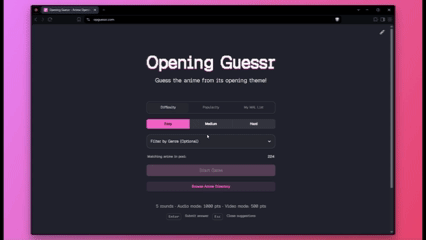

# Opening Guessr

An anime opening theme guessing game — listen to opening audio or 40s blurred clip, name the anime.

**[Play now → opguessr.com](https://opguessr.com)**

<!-- GIF of one full round: menu selection → listening → typing guess → answer reveal -->


Built with [Astro](https://astro.build) · [Alpine.js](https://alpinejs.dev) · [daisyUI](https://daisyui.com) · [Plyr](https://plyr.io)

## Features

- 🎵 **Audio-first gameplay** — listen to the opening, type the anime name. Autocomplete filters the pool as you type.
- 🎬 **Video clue** — unlock a blurred video hint (round drops from 1000 → 500 pts)
- 📋 **My MAL List** — play openings from your own MyAnimeList profile
- 🎭 **Genre filter** — narrow the pool by genre across all modes
- 🎨 **24 themes** — every daisyUI theme, toggleable from the top-right corner
- 📂 **Anime Directory** — browse all ~1900+ openings with search, filters, and detail pages

## Tech Stack

| Layer | Choice |
|---|---|
| Framework | [Astro](https://astro.build) 7 |
| UI logic | [Alpine.js](https://alpinejs.dev) 3 |
| Styles | [Tailwind CSS](https://tailwindcss.com) 4 + [daisyUI](https://daisyui.com) 5 |
| Media | [Plyr](https://plyr.io) |
| Icons | [Phosphor Icons](https://phosphoricons.com) |
| Font | [Geist Pixel](https://fontsource.org/fonts/geist-pixel) |
| Data | Tenrai API · AnimeThemes API · AniList API · MyAnimeList API v2 |

## Getting Started

```bash
pnpm install
astro dev --background
```

Dev server runs at `http://localhost:4321`.

## Build

```bash
pnpm build
pnpm preview
```

The `prebuild` step fetches ~1000 anime with usable openings from the Tenrai and AnimeThemes APIs and writes `public/data/openings.json`.

## My MAL List Mode

Enter a MyAnimeList username to play openings from that user's list (completed / watching / on-hold / dropped). Requires a `MAL_CLIENT_ID` env var — see `.env.example`. The Netlify function keeps it server-side.

To test locally, use `netlify dev` instead of `astro dev`.

## Contributing

PRs welcome. Please open an issue first for larger changes.

## License

This project is licensed under the [Business Source License 1.1](LICENSE).
Viewing and contributing via PRs is encouraged. Redistribution or hosting your own copy is not permitted.
